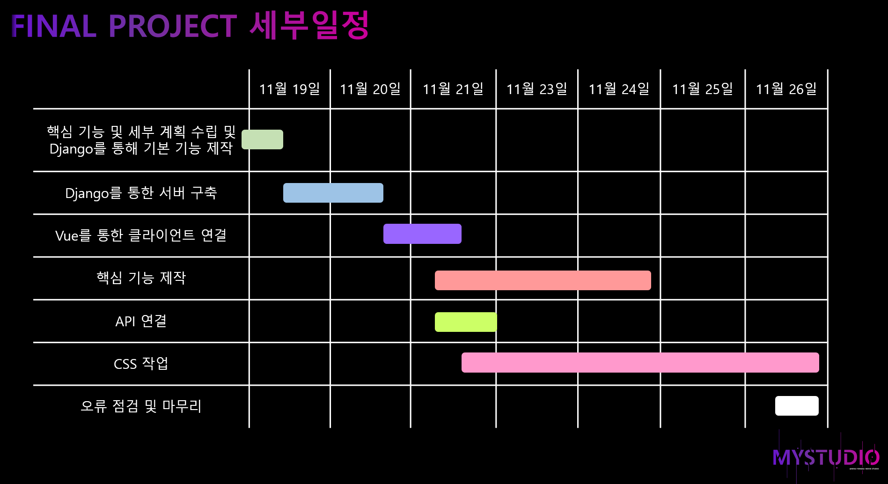
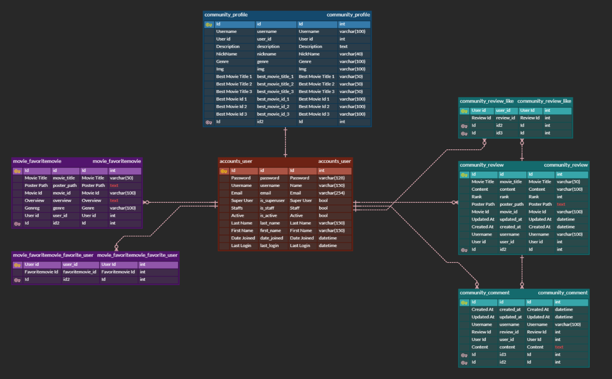
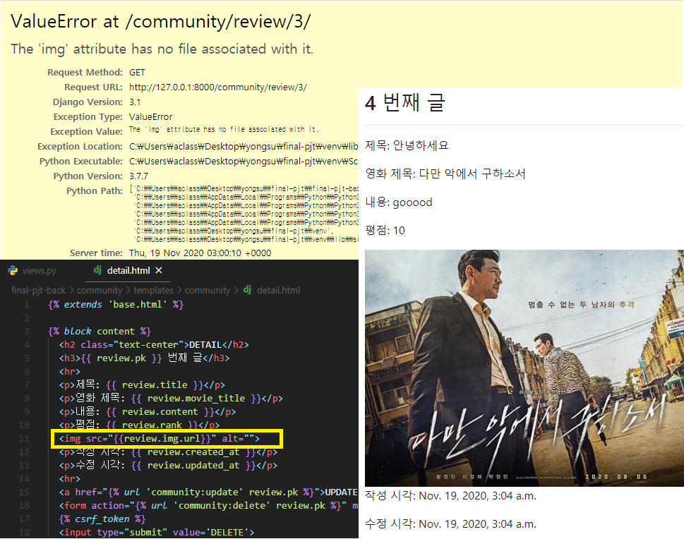
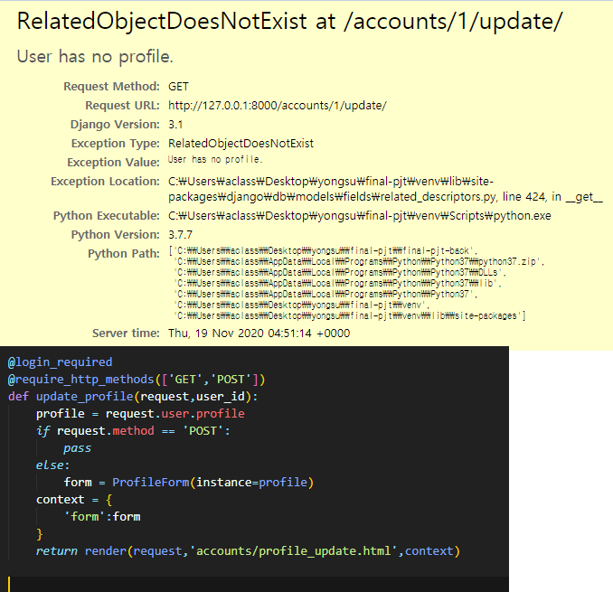
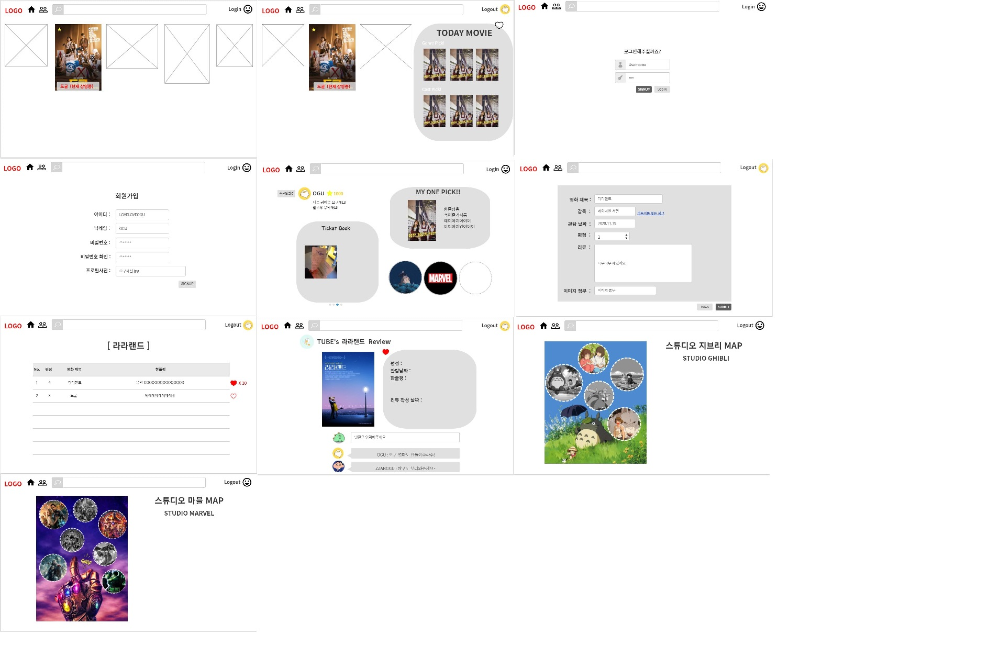
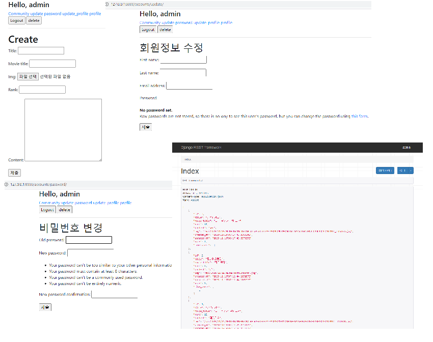
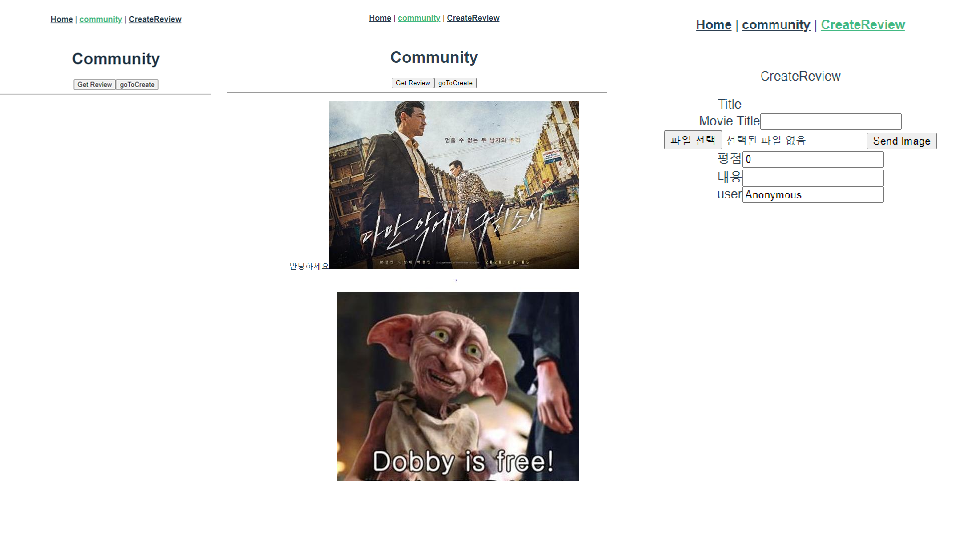
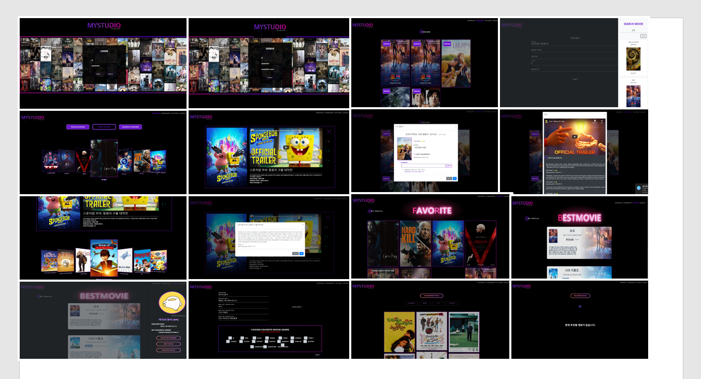

# FINAL PROJECT

### 1. 팀 정보

#### (1) 팀원 정보

- 권용수
- 강민지

#### (2) 업무 분담 내역

- 권용수 
  - Django server & Vue Client
- 강민지
  - Vue Client & Design

### 2. 목표 

- 영화 정보 기반 추천 서비스 구성
- 커뮤니티 서비스 구성 
- Django REST API 서버 및 프론트엔드 프레임워크(Vue.js) 분리를 통해 구현

### 3. 계획

#### (1) 세부 일정

#### (2) 기본 구현 예정 기능

- Movie 

  - 영화 등록 / 영화 수정 / 영화 삭제

    - 관리자만 가능
  
  - 영화 정보와 관련된 대화가 가능한 커뮤니티 기능
    - 리뷰 등록 (평점, 한줄평 등) / 리뷰 수정 / 리뷰 삭제 
      - 작성자 본인만 가능
    - 평점 등록 / 평점 수정 / 평점 삭제 /  댓글 등록 / 댓글 삭제
      - 로그인한 사용자만 가능
  - 영화 추천 알고리즘
  - 모든 게시글 및 댓글은 생성 및 수정 시각 정보 포함
  
- Account

  - 유저관리
    - 관리자만 가능
  - 로그인 / 로그아웃 / 회원가입 기능 

- 주의사항
  - 최소 5개 이상의 URL 및 페이지 구성
  - 메세지 프레임워크 등을 통한 에러 페이지 구성
  - Ajax활용한 비동기 요청 

  

#### (3) 추가적인 목표 기능

- [x] 좋아요기능 추가 
- [ ] TICKET BOOK 서비스 기능 추가 -> 취소
- [x] 나만의 베스트 영화 추천 기능 추가
- [ ] 장르 및 영화사 별 영화MAP 기능 추가 -> 취소
- [x] 장르를 기반으로 한 영화 추천 알고리즘
- [x] 영화 즐겨찾기 기능
- [x] 해외 사이트에서 추가적인 리뷰 받아오기

#### (4) 사용한 TOOLS

- Trello
- Git
- 카카오 OVEN
- VS CODE
- ERD Cloud

#### 4. ERD

#### 5. 프로젝트 과정

#### (1) 2020.11.19 (목)

##### TODAY 목표

- 권용수
  - Django를 이용해 기본 기능 Create, Read, Update, Delete 구현
  - Account의 Login, Logout, Signup, Password Change, Profile기능 구현
  - Profile에 이미지 추가 구현
- 강민지
  - 기본적인 Home, Index, Create, Mypage, Detail 화면 UI 구성 디자인 1차 기획
  - 예상 추가 기능 영화 Map 디자인
  - Today README작성

##### TODAY 오류 해결 과정

- 오류 : 사용자가 업로드한 이미지 파일을 보여주기 위해서 img 태그를 적용하였지만 저장이 되지 않고 이미지를 로드하지 못하는 오류가 발생
  - 해결 : 이미지를 저장하기 위해서 form 태그의 enctype="multipart/form-data" 속성을 지정

- 오류: 사용자의 프로필 업데이트를 위해서 별도의 Profile 모델을 구성 하였지만, 기본 프로필이 없어 오류 발생
  - 해결: 현재 해결중(11/19) > 해결(11/21) PUT 요청으로 요청 방식 변경

##### TODAY 결과

- 화면 디자인 1차 

- Django 구현

- Vue 구현

##### TODAY 느낀점

- 장고(서버)에서 간단하게 다운 및 업로드 하였던 이미지 파일등을 Vue(clinet)측에서 입력받아 서버로 업로드 및 다운로드 하는 것이 매우 어렵다는 것을 느낌
- 장고에서 정상 작동하던 기능들이 Vue와 연결하였을 경우, 정상 작동하지 않는 어려움이 있음
- 현재 이미지를 로드하고 저장하기 위해서 노력하고 있음

##### TOMORROW 계획 수립

- 디자인한 Mock-up을 바탕으로 Vue 파일 제작
- vue-django create  완성 (추가 API 적용)

---

#### (2) 2020.11.20 (금)

##### TODAY 목표

- 권용수
  - Create, Read, Delete, Update 기능 Django와 Vue연결
  - Rest auth를 이용해 새롭게 로그인 기능 구현
- 강민지
  - bootstrap vue 등을 이용한 각 페이지 디자인 구현
  - Today README작성

##### TODAY 오류 해결 과정

- 오류 : rest-auth 사용에 문제가 발생
  - 해결 : 공식 문서를 통해서 해결
    - `@authentication_classes([JSONWebTokenAuthentication])`
    - `@permission_classes([IsAuthenticated])`

- 오류: 어떤 오류인지 파악하기 힘듬
  - 해결: 콤마 때문에 오류 발생

##### TODAY 결과

##### TODAY 느낀점

- rest-auth라는 새로운 프레임 워크를 사용하여 간편하게 로그인 기능을 구현할 수 있었지만, 사용하는 것이 매우 까다로웠다.
- 모르는 것이 있으면 공식문서를 확인하자. 제발.
- https://django-rest-auth.readthedocs.io/en/latest/api_endpoints.html
- https://django-rest-auth.readthedocs.io/en/latest/configuration.html

##### TOMORROW 계획 수립

- API 가져오기
- router 연결

---

#### (3) 2020.11.21 (토)

##### TODAY 목표

- 권용수
  - API 가져오기
  - router 연결
  - Loadmap불러오기
- 강민지
  - 각 메인 페이지 CSS 미리 구현
  - 팀 로고 디자인 초안 제작

##### TODAY 오류 해결 과정

- 오류 : iframe 사용시 오류가 발생
  - 해결 : vue에서 사용하기 위해서 watch 방식이 아닌 embed방식으로 요청해야한다.

##### TODAY 결과

##### TODAY 느낀점

- 로드맵을 통해서 사용자만의 영화 목록을 보여주고 싶었지만, 클라이언트 쪽의 미디어 파일을 서버로 업로드는 하는 문제가 발생하여 해결하지 못했다.
- 제발....공식문서 좀.....
- https://developers.themoviedb.org/3/search/search-movies
- https://bootstrap-vue.org/docs

##### TOMORROW 계획 수립

- 추천알고리즘 기능 완성 (장르 기반)
- 추천 알고리즘을 위해 회원가입시 선호 장르 받기 
- 완성된 페이지 CSS

---

#### (4) 2020.11.23 (월)

##### TODAY 목표

- 권용수
  - 추천알고리즘 기능 완성 (장르 기반)
  - 추천 알고리즘을 위해 회원가입시 선호 장르 받기 
  - Movie List, Movie Recommaned페이지 CSS
- 강민지
  - 로고 최종 디자인 완성
  - Login , Signup, Community 페이지 CSS

##### TODAY 오류 해결 과정

- 오류 : 네이버 API 요청을 VUE에서 보냈지만 CORS 오류가 발생, 장고에 CORS오류 방어를 수행하였지만 여전히 발생
  - 해결 : 네이버는 사내 규칙으로 API 요청은 서버에서 보낸 요청만 응답

- 오류: 웹에 존재하는 스타일을 사용하기 위해서 적용하였지만 오류가 발생
  - 해결:  SCSS 를 CSS로 변환하여 적용

- SASS나 STYLUS형식으로 된 문서 변환하기-> 사이트 이용

##### TODAY 결과

##### TODAY 느낀점

- CSS GRID SYSTEM에 대한 이해가 높지 못 하여 아이콘 하나를 마음대로 배치하는 것이 매우 어려웠다.
- 오늘도 공식문서를 찾아다녔다...
- https://github.com/greyby/vue-spinner
- https://wlada.github.io/vue-carousel-3d/

##### TOMORROW 계획 수립

- Movie Detail, Create Review 등 완성된 페이지 CSS
- 즐겨찾기, 최애 영화 등 추가 기능 알고리즘 완성

---

#### (5) 2020.11.24 (화)

##### TODAY 목표

- 권용수
  - 좋아요 기능 알고리즘 완성
  - 즐겨찾기 기능 알고리즘 완성
  - 장르 추천 알고리즘 최종 완성
- 강민지
  - 완성된 페이지 CSS

##### TODAY 오류 해결 과정

- 오류 : 마침 태그에 의한 오류

- 오류: id 선택자를 적용하였지만 반응하지 않음
  - 해결: id선택자를 클래스 선택자로 선택하여 선택되지 않았음

오류: 클래스 인라인 속성을 부여했을 때 오류가 발생

- 해결: 한 줄로 코드가 표현되어 중복 클래스를 적용한 것을 인지하지 못함

##### TODAY 결과

##### TODAY 느낀점

- 태그의 끝을 반드시 확인하자!!!!!!!!!!!!!!
- 인라인 속성을 사랑하지 말자!!!!!!!!!

##### TOMORROW 계획 수립

- 최종 웹페이지 프로토 타입 완성

---

#### (6) 2020.11.25 (수)

##### TODAY 목표

- 권용수
  - 즐겨찾기 기능 추가
- 강민지
  - Design

##### TODAY 결과

##### TODAY 느낀점

- VUE를 이용하여 페이지간 이동시 데이터를 보내고 다시 이전 화면으로 돌아오는 것이 상당히 까다로웠다.

##### TOMORROW 계획 수립

- 최종 완성된 프로젝트 점검 및 테스트

---

#### (7) 2020.11.26 (목)

##### TODAY 목표

- 권용수
  - 완성!!!!!!!!!!!!!!!!!!!!!!
  - 12시전 퇴근
- 강민지
  - 완성!!!!!!!!!!!!!!!!!!!!!!
  - 12 시전 퇴근

##### TODAY 결과

##### TODAY 느낀점

- 아직 추가하고 싶은 기능이 많지만, 1학기 과정이 끝나고 개인적으로 추가하여 완성하겠다.
- 정말 잘 완성해서 배포하고 싶다....
- 로드맵은 반드시 완성시킬 것이다..

- 그리고 오늘은 12시 전 퇴근 실패...... 현재 시간 12시 11분....아직 할게 남았다......

